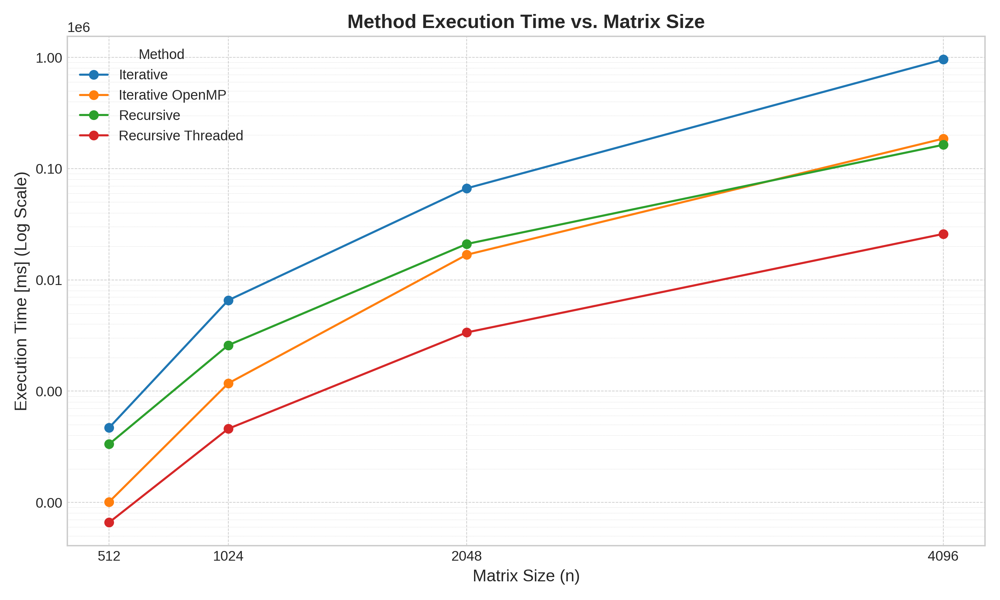

# Divide and Conquer for Matrix Multiplication
 
Implementation of Strassen's Algorithm for matrix multiplication using the Eigen library in C++. This implementation works for square matrices of size $2^n \times 2^n$.

## Compilation Instructions:

Ensure you have the Eigen library installed and accessible. Compile the program using a C++ compiler that supports C++11 or later. For example, with g++:

`g++ -O3  -I ../eigen/ src/iterativo.cpp -o iterativo`.

`g++ -O3 -fopenmp -I ../eigen/ src/iterativo_openmp.cpp -o iterativo_openmp`.

`g++ -O3  -I ../eigen/ src/recursivo.cpp -o recursivo`.

`g++ -O3 -pthread -I ../eigen/ src/recursivo_threaded.cpp -o recursivo_threaded`.

## Results:
The tests were performed on a system running an Intel Core i7-5930K CPU with a base clock speed of 3.50 GHz and a maximum frequency of 3.70 GHz. This processor features 6 physical cores and supports 12 threads (logical CPUs) using Hyper-Threading, all within a single socket on an x86_64 architecture. The system includes a total of 192 KiB L1d cache, 192 KiB L1i cache, 1.5 MiB L2 cache distributed across the cores, and a shared 15 MiB L3 cache, operating within a single NUMA node configuration for uniform memory access.

| Tamaño de Matriz (n) | Método             | Tiempo Eigen [ms] | Tiempo Método [ms] | Norma C (Eigen) | Norma C (Método) |
|----------------------|--------------------|-------------------|--------------------|-----------------|------------------|
| 512                  | Iterativo          | 24                | 469                | 3849.19         | 3849.19          |
| 512                  | Iterativo OpenMP   | 12                | 101                | 3849.19         | 3849.19          |
| 512                  | Recursivo          | 22                | 334                | 3849.19         | 3849.19          |
| 512                  | Recursivo Threaded | 21                | 66                 | 3849.19         | 3854.96          |
| 1024                 | Iterativo          | 168               | 6559               | 10929.5         | 10929.5          |
| 1024                 | Iterativo OpenMP   | 40                | 1175               | 10929.5         | 10929.5          |
| 1024                 | Recursivo          | 160               | 2588               | 10929.5         | 10929.5          |
| 1024                 | Recursivo Threaded | 163               | 459                | 10929.5         | 10940.2          |
| 2048                 | Iterativo          | 1290              | 66483              | 30902.8         | 30902.8          |
| 2048                 | Iterativo OpenMP   | 487               | 16803              | 30902.8         | 30902.8          |
| 2048                 | Recursivo          | 1342              | 21006              | 30902.8         | 30902.8          |
| 2048                 | Recursivo Threaded | 1345              | 3367               | 30902.8         | 30917.1          |
| 4096                 | Iterativo          | 10310             | 957171             | 87388.1         | 87388.1          |
| 4096                 | Iterativo OpenMP   | 1869              | 186015             | 87388.1         | 87388.1          |
| 4096                 | Recursivo          | 10078             | 163619             | 87388.1         | 87388.1          |
| 4096                 | Recursivo Threaded | 10082             | 25885              | 87388.1         | 87406.0          |

## TODO:

Implement Strassen's $O(n^{\log_2 7})$ algorithm and compare result with recursive and iterative algorithms.